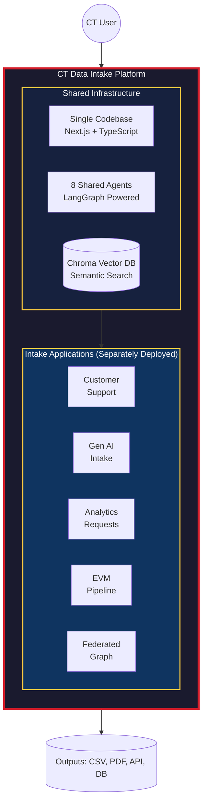
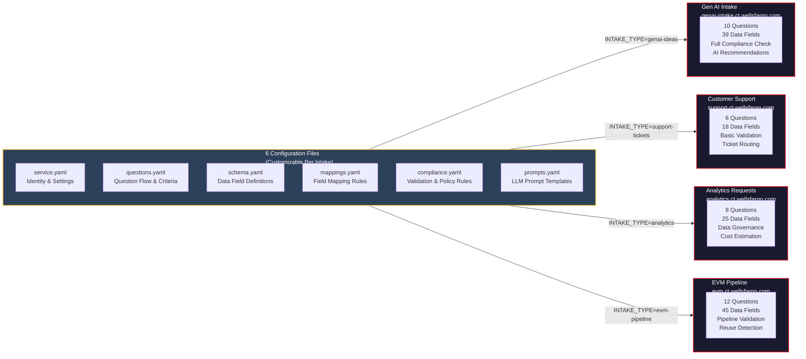
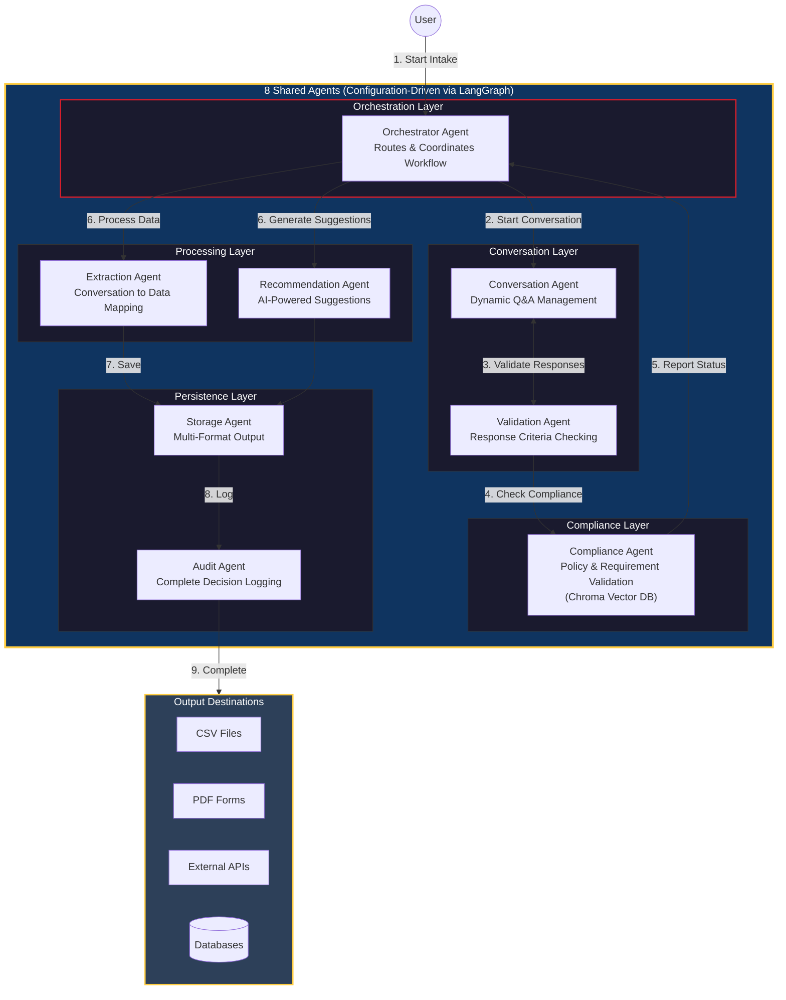

# CT Data Intake Platform - Architecture Diagrams

This document provides visual representations of the CT Data Intake Platform architecture, showing how it functions as an umbrella platform supporting multiple customizable intake applications.

---

## 1. Platform Overview (Umbrella Architecture)

**Key Concept:** Single codebase deployed multiple times, each deployment configured for a specific intake type.

The CT Data Intake Platform serves as a centralized umbrella that houses shared infrastructure while enabling independent intake applications to operate with their own configurations.

### What This Shows:
- **Umbrella Platform:** The outer container represents the CT Data Intake Platform
- **Shared Infrastructure:** Single codebase, 8 agents, and vector database serve all intakes
- **Multiple Intake Apps:** Each deployment (Customer Support, Gen AI, Analytics, etc.) runs independently
- **Unified Outputs:** All intakes produce standardized outputs (CSV, PDF, API calls, database records)

---

## 2. Configuration Customization Per Intake

**Key Concept:** No code changes required to add new intake types. Everything is configured via 6 YAML files.

Each intake application loads its own set of configuration files at startup, determined by the `INTAKE_TYPE` environment variable.

### Configuration Files Explained:

| File | Purpose | Example Customization |
|------|---------|----------------------|
| `service.yaml` | Service identity, branding, URLs | Logo, colors, deployment URL |
| `questions.yaml` | Question sequence and criteria | Number of questions, validation rules |
| `schema.yaml` | Data field definitions | Field names, types, required flags |
| `mappings.yaml` | Conversation-to-data mapping | How answers map to output fields |
| `compliance.yaml` | Policy and validation rules | Security checks, data governance |
| `prompts.yaml` | LLM prompt templates | Custom AI behavior per intake |

### Adding a New Intake Type:

1. Create a new folder: `/config/services/{new-intake-type}/`
2. Copy and customize the 6 YAML files
3. Deploy with `INTAKE_TYPE=new-intake-type`
4. No code changes required!

---

## 3. Agent Architecture & End-to-End Flow

**Key Concept:** 8 specialized agents work together, each configurable via the intake's configuration files.

The agents are organized into layers, each responsible for a specific part of the intake workflow.

### Agent Responsibilities:

| Layer | Agent | Responsibility | Configured By |
|-------|-------|----------------|---------------|
| Orchestration | **Orchestrator** | Routes requests, coordinates workflow | `service.yaml` |
| Conversation | **Conversation** | Manages dynamic Q&A dialogue | `questions.yaml`, `prompts.yaml` |
| Conversation | **Validation** | Checks response criteria | `questions.yaml` |
| Compliance | **Compliance** | Validates against policies | `compliance.yaml` |
| Processing | **Extraction** | Maps conversation to data fields | `mappings.yaml`, `schema.yaml` |
| Processing | **Recommendation** | Generates AI suggestions | `prompts.yaml` |
| Persistence | **Storage** | Saves to CSV, PDF, DB, APIs | `schema.yaml` |
| Persistence | **Audit** | Logs all decisions for compliance | `service.yaml` |

### End-to-End Flow:

1. **User Starts:** Selects intake type, begins submission
2. **Conversation:** Agent asks questions based on `questions.yaml`
3. **Validation:** Each response validated against criteria
4. **Compliance:** Policies checked via Chroma vector DB
5. **Orchestration:** Status reported, workflow continues
6. **Processing:** Extraction and Recommendation run in parallel
7. **Persistence:** Data saved to configured outputs
8. **Audit:** Complete decision trail logged
9. **Complete:** User receives confirmation and outputs

---

## Summary: Why This Architecture?

| Benefit | How It's Achieved |
|---------|-------------------|
| **Speed** | Reduce request-to-approval from weeks to days/hours |
| **Reusability** | Single codebase, multiple deployments |
| **No Code Changes** | 6 YAML files configure everything |
| **Governance** | Built-in compliance validation and audit trails |
| **Flexibility** | Each intake customized independently |
| **Visibility** | Unified dashboard across all CT initiatives |

---

## Related Documentation

- [Agentic Architecture Details](../AGENTIC_ARCHITECTURE.md) - Deep dive into agent implementation
- [Requirements Specification](../REQUIREMENTS.md) - Complete technical requirements
- [Project Plan](../projectplan.md) - Implementation status and roadmap
